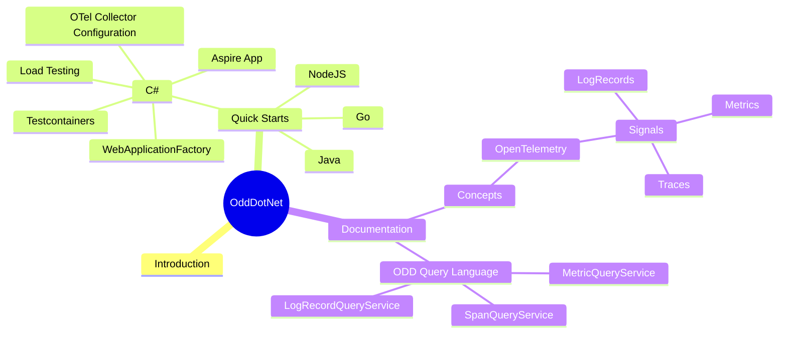

```mermaid
mindmap
    root((OddDotNet))
        Introduction
        Quick Starts
            C#
                Aspire App
                Testcontainers
                WebApplicationFactory
                Load Testing
                OTel Collector Configuration
            Go
            Java
            NodeJS
        Documentation
            Concepts
                OpenTelemetry
                    Signals
                        Traces
                        LogRecords
                        Metrics
            ODD Query Language
                SpanQueryService
                MetricQueryService
                LogRecordQueryService
```